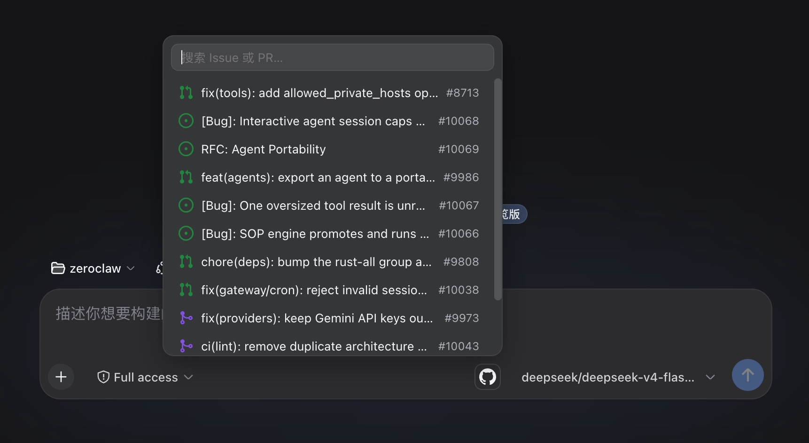

# dsh-github-picker

GitHub issue and pull request references for the DeepSeek Harness web GUI. Click the GitHub icon at the bottom-right of the input box (the composer's tool row, next to the send button) to open a searchable list of the current workspace repository's issues and pull requests, and insert a reference — a GitHub URL, or an `@owner/repo#number` mention.




## Install or Update

```sh
dsh plugin --profile web add https://github.com/bitxeno/dsh-github-picker/archive/refs/heads/main.tar.gz
```

Use the same command to update an existing installation — it always installs the latest commit on `main`, so the URL never needs a version bump. Restart `dsh web` after installation so the Host and browser client load the new version.

To pin a specific release instead, swap `refs/heads/main` for the tag ref, e.g. `refs/tags/v0.1.0`.

## Usage

Click the GitHub icon at the bottom-right of the input box. A searchable popup opens with the repository's recent issues and pull requests; keep typing in its search field to filter by number or title (a number prefix ranks first, like GitHub's own autocomplete). Click a row (or press Enter with the field focused and a row picked via click) to insert the reference; Escape or a click anywhere outside closes the popup. A search failure (gh CLI missing, not authenticated, rate limited, network error, unresolved repository) renders as one localized hint row instead of a silent close.

Each row shows GitHub's own state icon, the title, and the `#number` tag:

| State | Icon | Color |
| --- | --- | --- |
| Open issue | `issue-opened` | green |
| Closed issue | `issue-closed` (check) | purple |
| Open PR | `git-pull-request` | green |
| Draft PR | `git-pull-request-draft` | gray |
| Closed, unmerged PR | `git-pull-request-closed` (×) | red |
| Merged PR | `git-merge` | purple |

Picking inserts one of two texts, chosen in Settings (**Insert format**):

```text
@owner/name#125                                 # format: ref (default)
https://github.com/owner/name/issues/125        # format: url
```

Before the agent starts a step, the Host scans the draft for GitHub references — URLs, `@owner/repo#number` forms, and bare `#number` tokens — and adds a short reference message for each:

```xml
<github-reference repo="owner/name" number="125" />
```

The plugin passes the repository and number only — it never fetches issue bodies. The agent can inspect a reference with its available tools when the task requires it.

## Data Source

The plugin uses the **gh CLI** exclusively — reuse the local `gh` login and call `gh api search/issues`, which returns issues and pull requests in one query. No device flow, OAuth app, or stored credential is involved; the settings page shows the gh connection status (which accounts `gh auth status` reports). `gh` CLI works on macOS, Linux, and Windows.

The repository is always resolved from the workspace `git remote get-url origin` (https, ssh, and `git@` forms); without a resolvable repository the popup shows a hint row explaining how to add a remote.

## Settings

Open **Settings -> GitHub 引用** to configure:

- **Connection card** — the gh CLI connection status: a GitHub-marked card showing "GitHub **via gh CLI**" with a **Connected** (green) or **Not connected** pill.
- **Insert format** — `@owner/repo#number` (default) or `GitHub URL` for the picked text.

There is no enable switch: the picker is always available in the composer.

## Configuration

Host plugin configuration goes into the selected profile's `cordis.patch.yml`:

```yaml
- id: dsh-github-picker
  config:
    defaultLimit: 20
    searchTimeoutMs: 15000
    repoCacheTtl: 30000
```

- `defaultLimit` caps entries per search (default 20).
- `searchTimeoutMs` bounds provider calls (default 15000).
- `repoCacheTtl` caches the resolved repository per workspace (default 30000 ms).

A Host config change needs a `dsh web` restart; a pure client change only needs a browser refresh.

## Notes

- The picker is a component in the framework's `conversation.input.right` composer slot (the seat just before the send button), the same seam the reference dsh-skill-picker uses: an icon button whose popup is a plain sibling positioned `absolute; bottom: calc(100% + 8px); right: 0` inside a relative wrapper. No custom trigger, overlay, or keyboard capture exists.
- Picking writes the full next draft through the framework input machine (`inputActions.setDraft`), so undo history and the Host's mention scanning work automatically.
- The popup loads the recent issue/PR list once per open (cached per session for 30 seconds; reopening is instant within the TTL and refetches after it) and filters locally per keystroke, so typing never stacks provider calls.
- The `#number` / URL / `@owner/repo#number` mention grammar is shared by the Host's pre-step scanner (`scanMentions`) and the picker's inserted text; keep them in sync when changing either.
- A search failure is classified and rendered in the popup as one localized hint row (see the `picker.error.*` copy in `src/client/locales.ts`), so "gh is not installed" is visible instead of a silent close.

## Development

```sh
pnpm install
pnpm run check
```

The check ladder is typecheck + tests + build with 100% coverage per source file. Dev dependencies are `link:` entries into the installed harness packages (see `AGENTS.md`); built files under `lib/` are committed so profile installation runs without a build.

To install a local checkout instead (development builds or unreleased changes), add the package to `~/.dsh/profiles/web/package.json`:

```json
{
  "dependencies": {
    "dsh-github-picker": "file:/path/to/dsh-github-picker"
  },
  "dsh": {
    "profile": {
      "bundles": ["...", "dsh-github-picker"]
    }
  }
}
```

Then `pnpm install` inside the profile and restart `dsh web`. Refresh the browser page. The plugin serves at `/plugins/dsh-github-picker/client.js` and the gateway routes `/api/githubPicker/*`. The client bundle is read per request, so a pure client change only needs a refresh; a Host contract change needs the `dsh web` restart.

## License

MIT